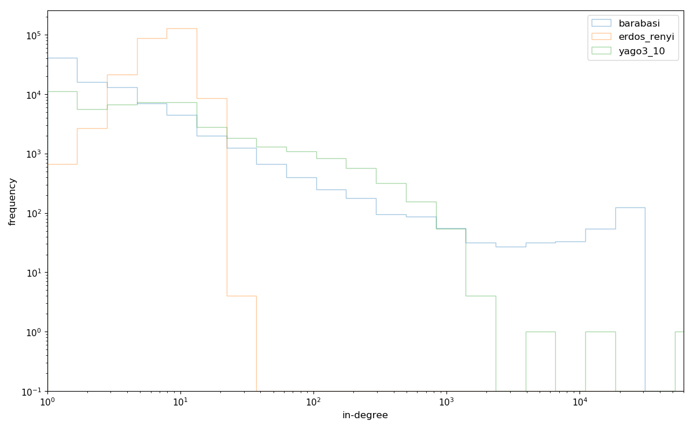
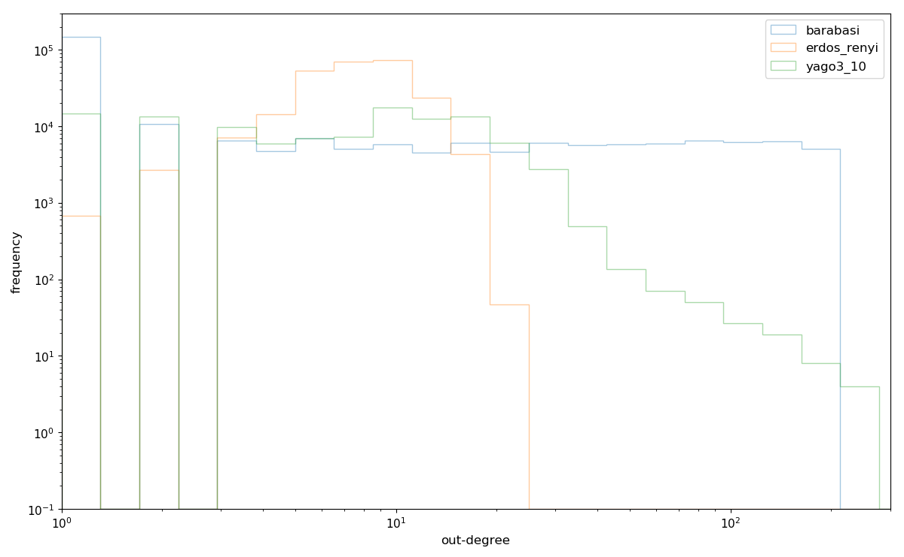
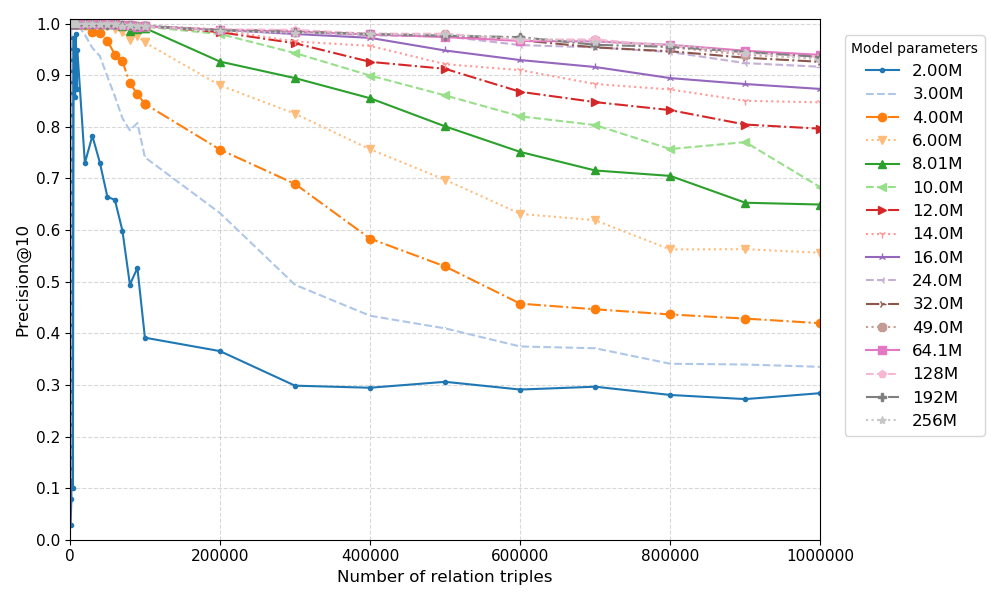
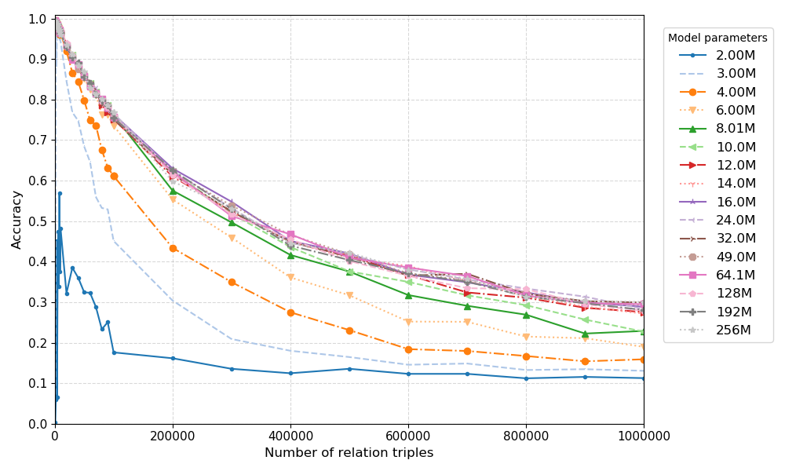

The graph structure of YAGO3 looks closer to a scale-free network than to a uniformly random graph.

But: YAGO3 is as easy to memorize as a uniformly random graph:

One problem: low accuracy due to ambiguous paths (different objects possible for same subject and predicate)

